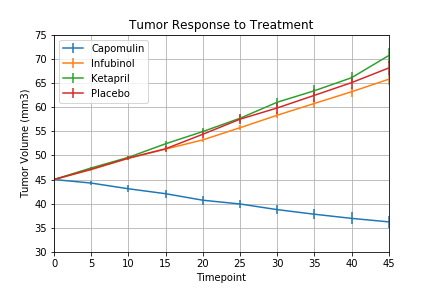

# Pymaceuticals

Using a more algebraic approach compared to my other repositories, this project focuses on affects of drugs on mice and tumors over time. This project introduces Matplotlib in conjunction with Python Programming. Some notable statistics are based on displaying effect from a specific time period, a metastatic spread of the drug on tumors, and the survival rate of the subjects through prolonged usage. This project attempts to take the overwhelming surge of data and simplify it using data visualization techniques.
--------------------------------------------------------------------------------------
BELOW IS A PREVIEW OF THE PROJECT
--------------------------------------------------------------------------------------
FIGURE 1: Displaying the effects of drugs throughout the time period

--------------------------------------------------------------------------------------
--------------------------------------------------------------------------------------
FIGURE 2: Shows the Metastatic Spread of the drugs effect on tumors

--------------------------------------------------------------------------------------
--------------------------------------------------------------------------------------
FIGURE 3: Displays the survival rate of the mice through prolonged usage

--------------------------------------------------------------------------------------
--------------------------------------------------------------------------------------
